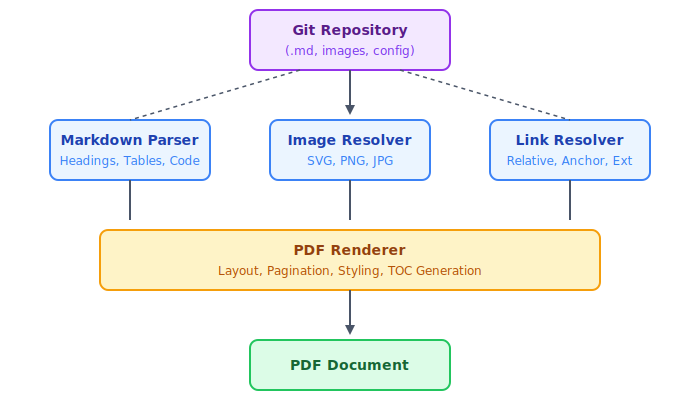

# Image Examples

This document tests every image inclusion pattern that GITMD2PDF should support.

---

## 1. Relative Path — PNG Images

### Basic Image

### Image with Alt Text Only (no title)

### Image with Title Attribute

---

## 2. Relative Path — SVG Images

### Pipeline Diagram (SVG)

*Figure 1: The Markdown-to-PDF conversion pipeline*

### Architecture Diagram (SVG)

*Figure 2: GITMD2PDF internal architecture*

---

## 3. Images in Context

Below is a paragraph followed by an image, followed by another paragraph. The PDF should lay these out naturally with appropriate spacing.

The GITMD2PDF tool processes Markdown files from a Git repository and produces professionally formatted PDF documents. The pipeline diagram below illustrates the high-level flow:

After conversion, the resulting PDF can be distributed to stakeholders, embedded in documentation portals, or archived for compliance purposes.

---

## 4. Multiple Images in Sequence

These images should appear one after another with consistent spacing:

---

## 5. Image Inside a Table

| Feature   | Preview                                      | Status   |
|-----------|----------------------------------------------|----------|
| Pipeline  |   | Complete |
| Blue      |            | Complete |

---

## 6. Image Inside a List

- Project documentation:
  - Pipeline: 
- Brand assets:
  - Logo: 

---

## 7. Image Inside a Blockquote

> The architecture diagram below shows how the system components interact:
>
> 
>
> — *From the GITMD2PDF technical specification*

---

## 8. Linked Image (Image as a Clickable Link)

---

## 9. Image with Missing File (Alt Text Fallback)

The following image references a file that does not exist. The PDF should display the alt text gracefully:

---

## 10. Side-by-Side Reference (Using a Table)

| Before | After |
|--------|-------|
|  |  |

---

*This document is part of the GITMD2PDF test repository.*
