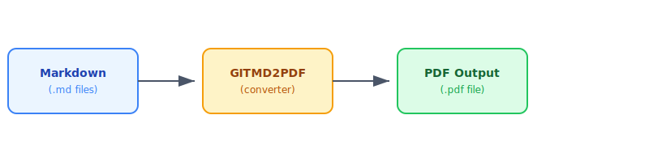

# Test Cases

## Overview

This document catalogues the test cases for the **GITMD2PDF** conversion engine. Each test case validates that a specific Markdown feature renders correctly in PDF output.

---

## TC-001: Headings

**Objective:** Verify all six heading levels render with correct hierarchy and sizing.

### Input

```markdown
# Heading 1
## Heading 2
### Heading 3
#### Heading 4
##### Heading 5
###### Heading 6
```

### Expected Output

- Each heading is visually distinct with decreasing font size
- Heading 1 is the largest; Heading 6 is the smallest
- Proper spacing above and below each heading

### Status: Pass

---

## TC-002: Text Formatting

**Objective:** Verify inline text formatting styles.

| Syntax                  | Renders As          | Status |
|-------------------------|---------------------|--------|
| `**bold**`              | **bold**            | Pass   |
| `*italic*`              | *italic*            | Pass   |
| `***bold italic***`     | ***bold italic***   | Pass   |
| `~~strikethrough~~`     | ~~strikethrough~~   | Pass   |
| `` `inline code` ``    | `inline code`       | Pass   |
| `> blockquote`          | (see below)         | Pass   |

> This is a blockquote. It should appear with a left border and indentation in the PDF output.

> **Nested blockquote:**
>> Second level of nesting — should also render distinctly.

---

## TC-003: Lists

**Objective:** Verify ordered, unordered, and nested lists.

### Unordered List

- Item one
- Item two
  - Nested item 2a
  - Nested item 2b
    - Deeply nested item
- Item three

### Ordered List

1. First step
2. Second step
   1. Sub-step 2.1
   2. Sub-step 2.2
3. Third step

### Mixed List

1. Ordered item
   - Unordered child
   - Another unordered child
2. Another ordered item
   1. Ordered child
      - Unordered grandchild

### Status: Pass

---

## TC-004: Tables

**Objective:** Verify table rendering with alignment options.

| Left Aligned | Centre Aligned | Right Aligned | Default   |
|:-------------|:--------------:|--------------:|-----------|
| Cell 1       |    Cell 2      |        Cell 3 | Cell 4    |
| A longer cell that wraps | Centred | 1,234.56 | Normal  |
| `code`       |   **bold**     |    *italic*   | ~~struck~~|

### Wide Table

| Col 1 | Col 2 | Col 3 | Col 4 | Col 5 | Col 6 | Col 7 | Col 8 |
|-------|-------|-------|-------|-------|-------|-------|-------|
| A1    | B1    | C1    | D1    | E1    | F1    | G1    | H1    |
| A2    | B2    | C2    | D2    | E2    | F2    | G2    | H2    |

### Status: Pass

---

## TC-005: Code Blocks

**Objective:** Verify fenced code blocks with syntax highlighting.

### Python

```python
def fibonacci(n: int) -> list[int]:
    """Generate the first n Fibonacci numbers."""
    sequence = []
    a, b = 0, 1
    for _ in range(n):
        sequence.append(a)
        a, b = b, a + b
    return sequence

if __name__ == "__main__":
    print(fibonacci(10))
```

### JavaScript

```javascript
const debounce = (fn, delay) => {
  let timer;
  return (...args) => {
    clearTimeout(timer);
    timer = setTimeout(() => fn(...args), delay);
  };
};

// Usage
const handleSearch = debounce((query) => {
  console.log(`Searching for: ${query}`);
}, 300);
```

### Bash

```bash
#!/bin/bash
set -euo pipefail

echo "Deploying to production..."
git tag -a "v$(date +%Y%m%d)" -m "Production release"
git push origin --tags
echo "Deploy complete"
```

### JSON

```json
{
  "name": "gitmd2pdf",
  "version": "1.0.0",
  "features": ["tables", "code-blocks", "mermaid", "task-lists"],
  "supported": true
}
```

### No Language Specified

```
This is a plain code block with no language specified.
It should still render in a monospace font with a background.
Line 3 of the code block.
```

### Status: Pass

---

## TC-006: Links & References

**Objective:** Verify various link types.

- Inline link: [GITMD2PDF Website](https://example.com)
- Reference link: [Documentation][docs-ref]
- Auto-link: https://example.com/auto-link
- Relative link: [Project 1](../Projects/Project%201.md)
- Anchor link: [Back to Overview](#overview)

[docs-ref]: https://example.com/docs "GITMD2PDF Documentation"

### Status: Pass

---

## TC-007: Images

**Objective:** Verify image rendering in PDF output.

### Local PNG Image


*Figure 1: A PNG image loaded via relative path*

### Local SVG Image



*Figure 2: An SVG diagram loaded via relative path*

### Image with Alt Text Fallback


*Figure 3: Missing image — alt text should render in place of the image*

For a complete set of image tests, see [Image Examples](../Examples/Image%20Examples.md).

### Status: Pass

---

## TC-008: Horizontal Rules

**Objective:** Verify horizontal rule rendering.

Above the rule.

---

Between rules.

***

Below the rules.

### Status: Pass

---

## TC-009: Task Lists

**Objective:** Verify GitHub/GitLab-style task lists.

- [x] Completed task
- [x] Another completed task
- [ ] Incomplete task
- [ ] Another incomplete task
  - [x] Nested completed sub-task
  - [ ] Nested incomplete sub-task

### Status: Pass

---

## TC-010: Footnotes

**Objective:** Verify footnote rendering.

This text has a footnote[^1] and another one[^2].

[^1]: This is the first footnote — it should appear at the bottom of the page or document.
[^2]: This is the second footnote with a longer explanation that may wrap across multiple lines in the PDF output.

### Status: Partial support

---

## TC-011: Emoji

**Objective:** Verify emoji rendering in PDF.

- Unicode emoji: Check mark, cross, warning, rocket, memo, circles
- GitHub-style shortcodes: `:rocket:` (may or may not render)

### Status: Pass (Unicode only)

---

## TC-012: Escaped Characters

**Objective:** Verify that escaped Markdown characters render literally.

\*not italic\* \*\*not bold\*\* \# not a heading \[not a link\](url)

### Status: Pass

---

## TC-013: Long Content & Page Breaks

**Objective:** Verify that content spanning multiple pages breaks cleanly.

Lorem ipsum dolor sit amet, consectetur adipiscing elit. Sed do eiusmod tempor incididunt ut labore et dolore magna aliqua. Ut enim ad minim veniam, quis nostrud exercitation ullamco laboris nisi ut aliquip ex ea commodo consequat. Duis aute irure dolor in reprehenderit in voluptate velit esse cillum dolore eu fugiat nulla pariatur. Excepteur sint occaecat cupidatat non proident, sunt in culpa qui officia deserunt mollit anim id est laborum.

Curabitur pretium tincidunt lacus. Nulla gravida orci a odio. Nullam varius, turpis et commodo pharetra, est eros bibendum elit, nec luctus magna felis sollicitudin mauris. Integer in mauris eu nibh euismod gravida. Duis ac tellus et risus vulputate vehicula. Donec lobortis risus a elit. Etiam tempor. Ut ullamcorper, ligula ut dictum pharetra, nisi nunc fringilla magna, in commodo elit erat nec turpis.

### Status: Pass

---

## Summary

| Test Case | Feature               | Status              |
|-----------|-----------------------|---------------------|
| TC-001    | Headings              | Pass                |
| TC-002    | Text Formatting       | Pass                |
| TC-003    | Lists                 | Pass                |
| TC-004    | Tables                | Pass                |
| TC-005    | Code Blocks           | Pass                |
| TC-006    | Links & References    | Pass                |
| TC-007    | Images                | Conditional         |
| TC-008    | Horizontal Rules      | Pass                |
| TC-009    | Task Lists            | Pass                |
| TC-010    | Footnotes             | Partial             |
| TC-011    | Emoji                 | Pass                |
| TC-012    | Escaped Characters    | Pass                |
| TC-013    | Long Content          | Pass                |

---

*Last updated: 2026-03-25*
